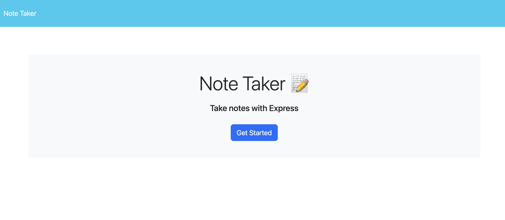
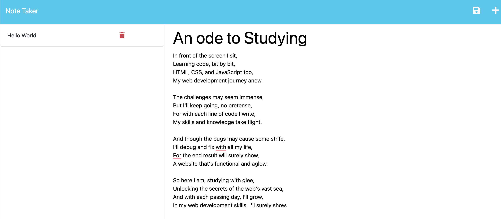

# Note Taking App 📝

## Link to Live App

https://adam-shalalas-note-taking-app.herokuapp.com/

## Description

- This app allows for the creation of notes, deletion and storage all to a simple JSON db deployed using Heroku. 

### Why
-  To practice how to use Express node app. To make api  calls 
### Problem this app solves
- Allows for the creation of notes, deletion and storage
### Learnings
- Learnt how to use Express, FS and how to deploy to  Heroku.

## Table of contents:

- [Installation](#installation)
- [Usage](#usage)
- [Contributing](#contributing)
- [Tests](#tests)
- [License](#license)
- [Questions](#questions)

## Installation

- Code editor (e.g. Visual Studio Code) Modern web browser (e.g. Google Chrome, Mozilla Firefox)

## Usage

Open the Develop folder which is the root directory. Then open server.js in the CLI and run npm install to install all packages. Once installed run node server.js

### Screenshot 

## Contributing

### To contribute to our project, please follow these steps:

- Fork the repository and create a new branch for your changes.
- Make your changes and commit them to your branch.
- Push your changes to your forked repository.
- Submit a pull request to our repository.
- Please provide a clear and descriptive title for your pull request, along with a detailed description of the changes you have made. We also ask that you include any relevant tests or documentation updates with your changes.

## Tests

undefined

## License

This project is licensed under the mit license.

## Questions

If you have any questions or feedback on the project, feel free to reach out to me at:

- Email: ashalala93@gmail.com
- GitHub: https://github.com/supershalala

